

# راهنمای حسابدار آنلاین آموزا

**حسابداری، انبارداری و فروش — در یک نرم‌افزار رایگان**

---

## مقدمه: چرا فروشندگان به آموزا نیاز دارند؟

اگر مغازه دارید، واردکننده هستید یا با چند فروشنده کار می‌کنید، احتمالاً این سناریوها را می‌شناسید:

- قیمت دلار عوض شد و باید **صدها کالا** را دوباره قیمت‌گذاری کنید
- نمی‌دانید **چقدر سود** کردید — فقط می‌دانید «فروش خوب بود»
- مشتری **بدهکار** است ولی یادتان رفت چقدر و کی پرداخت کرد
- **اجاره مغازه** و حقوق فروشنده هر ماه تکرار می‌شود ولی ثبتش سخت است
- فیش بانکی و رسید پرداخت **پراکنده** در گوشی یا کاغذ است

**حسابدار آنلاین آموزا** همه این‌ها را در یک جا حل می‌کند: انبار، حسابداری، فروش، مشتری، حقوق کارمند، مخارج دوره‌ای، گزارش زنده — و مهم‌تر از همه: **کاملاً رایگان**.

> **یک بار امتحان کنید.** ثبت‌نام کمتر از یک دقیقه طول می‌کشد: [hesab.amoza.ir](https://hesab.amoza.ir)

---

## نسخه‌ها و دسترسی

| نسخه | توضیح |
|------|--------|
| **وب آنلاین** | از هر مرورگر — [hesab.amoza.ir](https://hesab.amoza.ir) |
| **دسکتاپ آفلاین** | نصب روی کامپیوتر؛ داده‌ها محلی (SQLite) — بدون اینترنت |
| **دسکتاپ + آنلاین** | همگام‌سازی با سرور؛ انتخاب در تنظیمات |
| **کراس‌پلتفرم** | **لینوکس، ویندوز، مک** |

### سه حالت رنگی

در پایین منوی کناری، آیکون ماه/خورشید را بزنید:

- **روشن** — برای محیط‌های پرنور
- **تاریک** — راحت برای چشم، حرفه‌ای و مدرن
- **سیستمی** — هماهنگ با تنظیمات سیستم‌عامل

---

## شروع کار

1. به [hesab.amoza.ir](https://hesab.amoza.ir) بروید
2. **ثبت‌نام** کنید (ایمیل و رمز عبور)
3. وارد **داشبورد مالی** شوید
4. قبل از هر چیز، **تنظیمات اولیه** را انجام دهید (بخش بعد)

---

## بخش ۱: تنظیمات اولیه

### ۱.۱ نرخ‌های ارز — قیمت‌گذاری بدون ماشین‌حساب

واردکننده هستید؟ دلار، درهم و یوان را **یک‌بار** وارد کنید؛ بقیه کار را آموزا انجام می‌دهد.

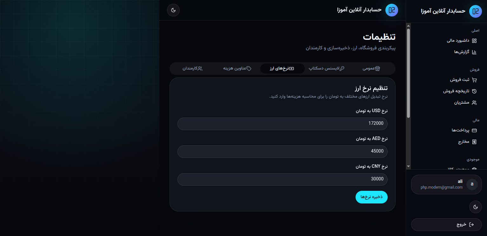

**مراحل:**

1. از منوی راست **تنظیمات** را باز کنید
2. تب **نرخ‌های ارز** را انتخاب کنید
3. نرخ **دلار، درهم (AED) و یوان (CNY)** را به تومان وارد کنید
4. **ذخیره نرخ‌ها** را بزنید

> **نکته:** وقتی بازار ارز تکان خورد، فقط نرخ‌ها را عوض کنید — قیمت فروش تمام محصولات به‌روز می‌شود. نیازی به ویرایش تک‌تک کالاها نیست.

---

### ۱.۲ عناوین هزینه — ردیف‌های آماده برای قیمت‌گذاری

قبل از تعریف محصول، **عناوین هزینه** را بسازید: حمل از چین، حمل از دبی، بسته‌بندی، قیمت پایه و ...

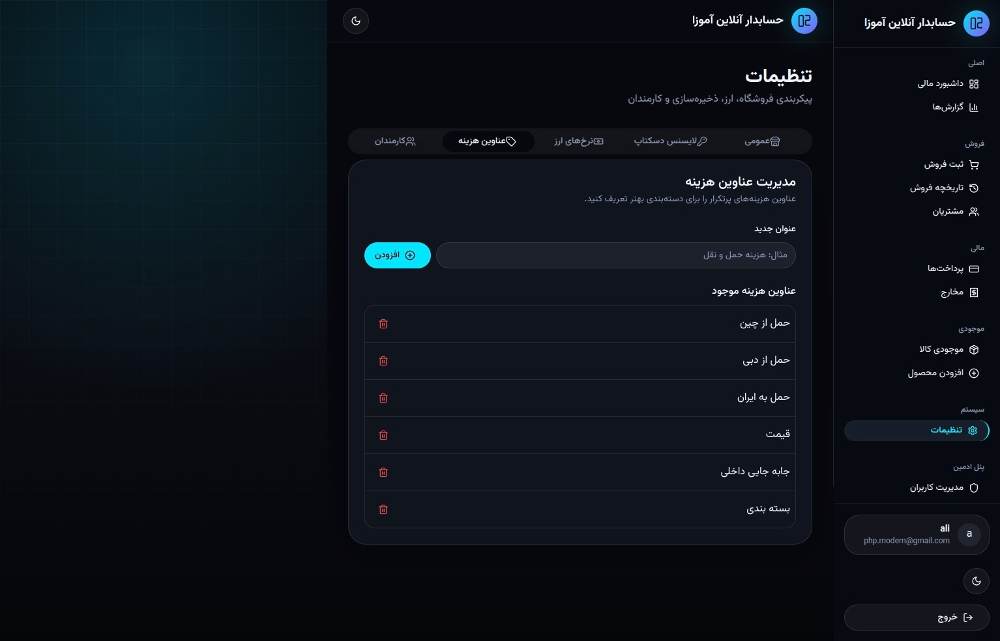

**مراحل:**

1. **تنظیمات → عناوین هزینه**
2. عنوان جدید بنویسید (مثلاً «حمل از چین»)
3. **افزودن** را بزنید
4. برای حذف، آیکون سطل زباله را بزنید

> **نکته:** این عناوین در **افزودن محصول** به‌صورت لیست کشویی ظاهر می‌شوند — هر کالا می‌تواند ترکیب متفاوتی از هزینه‌ها با **ارزهای مختلف** داشته باشد.

---

### ۱.۳ کارمندان — حقوق و دستمزد خودکار

فروشنده یا حسابدار دارید؟ یک‌بار تعریف کنید؛ حقوق ماهانه به‌صورت خودکار در مخارج دوره‌ای ثبت می‌شود.

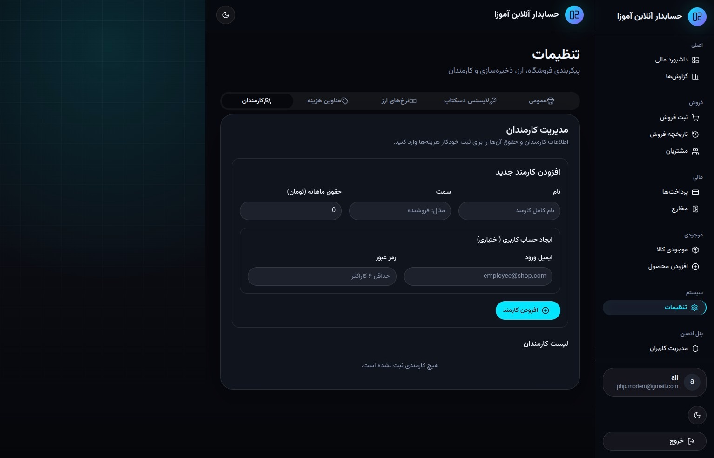

**مراحل:**

1. **تنظیمات → کارمندان**
2. نام، سمت و **حقوق ماهانه (تومان)** را وارد کنید
3. (اختیاری) ایمیل و رمز برای **ورود کارمند** به سیستم
4. **افزودن کارمند** را بزنید

> **نکته:** با ثبت کارمند، هزینه «حقوق {نام}» به‌صورت خودکار در مخارج دوره‌ای ایجاد می‌شود — دیگر فراموش نمی‌کنید حقوق را در گزارش سود لحاظ کنید.

---

## بخش ۲: محصول و انبار

### ۲.۱ افزودن محصول — قیمت‌گذاری چندارزی و هوشمند

قلب سیستم: تعریف کالا با **بارکد**، هزینه‌های چندارزی، حاشیه سود و پیش‌نمایش زنده قیمت.

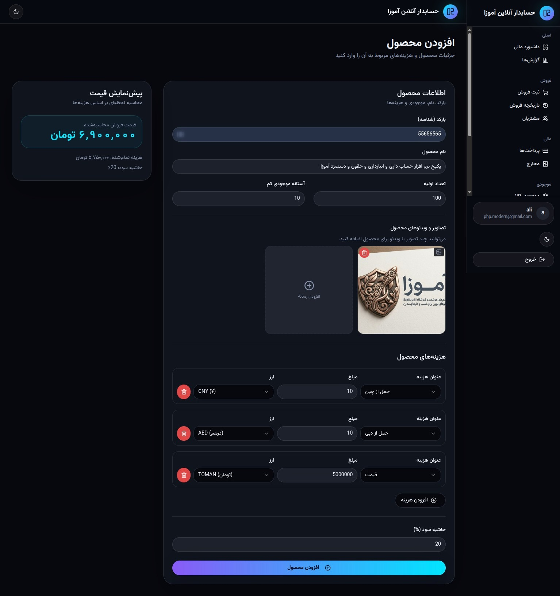

**مراحل:**

1. از منو **افزودن محصول** را باز کنید
2. **بارکد (ID)** و **نام محصول** را وارد کنید
3. **موجودی اولیه** و **آستانه کمبود موجودی** را تنظیم کنید
4. در بخش **هزینه‌های محصول**، ردیف اضافه کنید:
   - عنوان (مثلاً حمل از چین) + مبلغ + **ارز** (یوان، درهم، تومان)
5. **حاشیه سود (%)** را وارد کنید
6. در پنل **پیش‌نمایش قیمت** سمت چپ، قیمت فروش محاسبه‌شده و هزینه را ببینید
7. (اختیاری) تصویر یا ویدیو محصول آپلود کنید
8. **افزودن محصول** را بزنید

> **نکته:** بارکد را با **اسکنر** هم می‌توانید وارد کنید — در ثبت فروش هم اسکن مستقیم کار می‌کند.

---

### ۲.۲ موجودی کالا — همه چیز یک‌جا

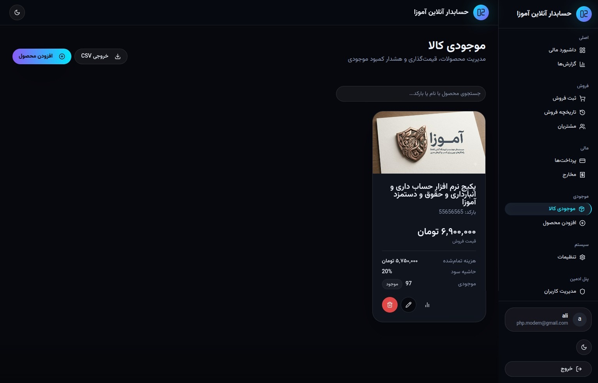

**امکانات:**

- جستجو با **نام یا بارکد**
- نمایش **قیمت فروش، هزینه تمام‌شده، حاشیه سود، موجودی**
- **هشدار کمبود موجودی** وقتی به آستانه برسد
- ویرایش، حذف و **خروجی CSV** برای آرشیو

> **نکته:** بعد از هر فروش، موجودی خودکار کم می‌شود — نیازی به به‌روزرسانی دستی نیست.

---

## بخش ۳: مشتریان

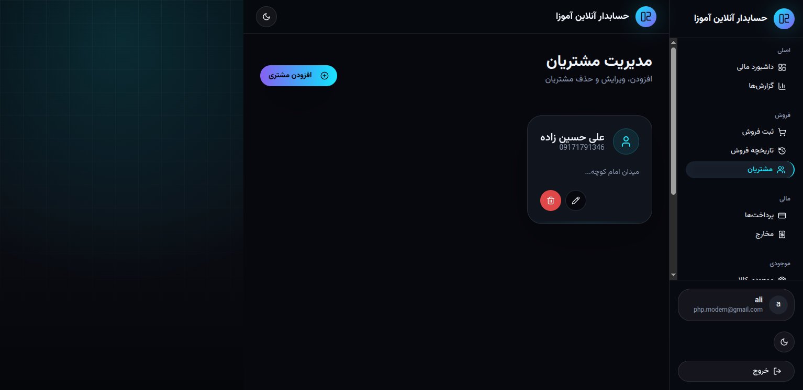

**مراحل:**

1. **مشتریان** را از منوی فروش باز کنید
2. **افزودن مشتری** — نام، موبایل، آدرس
3. در **ثبت فروش** مشتری را انتخاب کنید تا تاریخچه و بدهی ردیابی شود

> **نکته:** مشتری بدهکار در **تاریخچه فروش** با برچسب قرمز «بدهکار» نمایش داده می‌شود.

---

## بخش ۴: ثبت فروش (POS)

### ۴.۱ فروش سریع — مثل صندوق فروشگاه

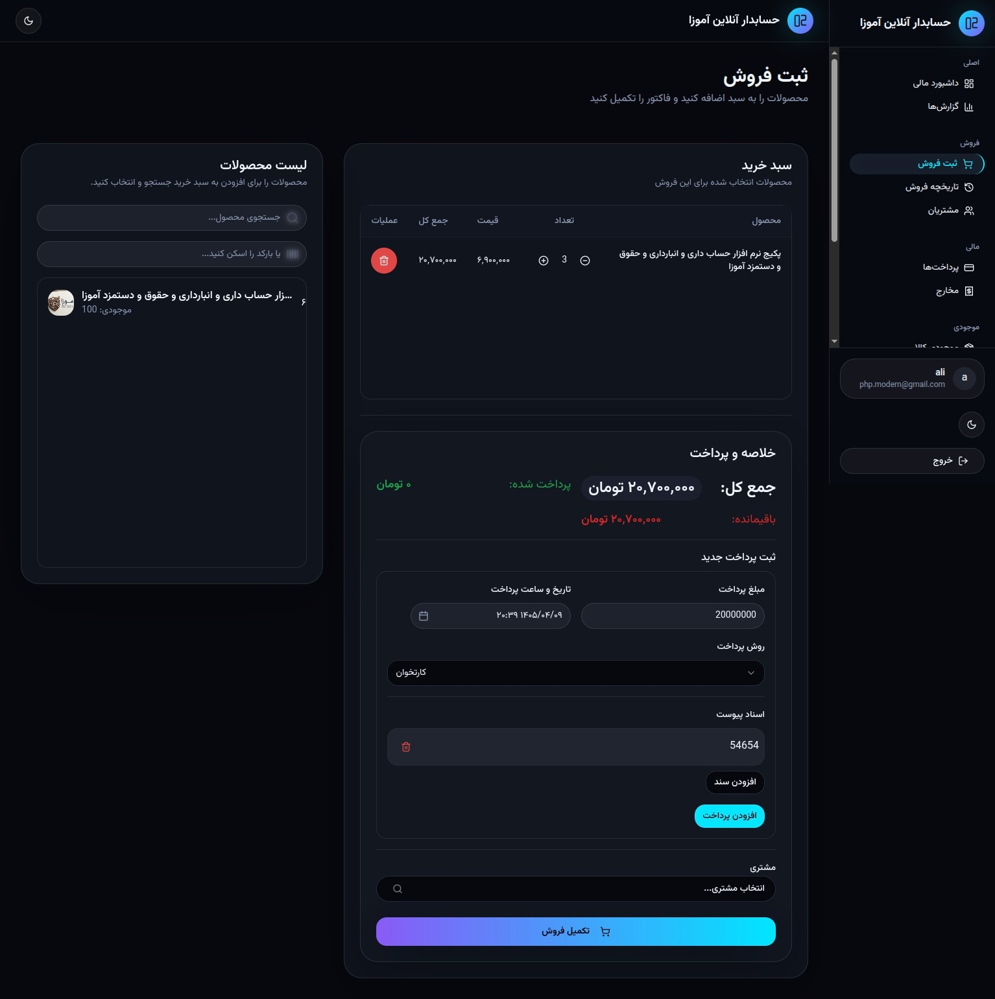

**مراحل:**

1. **ثبت فروش** را باز کنید
2. محصول را **جستجو** یا **بارکد اسکن** کنید
3. به **سبد خرید** اضافه کنید — تعداد را با +/− تنظیم کنید
4. در **خلاصه و پرداخت**، مبلغ کل را ببینید
5. **پرداخت جدید** ثبت کنید (نقد، کارتخوان، آنلاین)
6. (اختیاری) **مشتری** را انتخاب کنید
7. **تکمیل فروش** را بزنید

---

### ۴.۲ پرداخت جزئی — باقیمانده خودکار

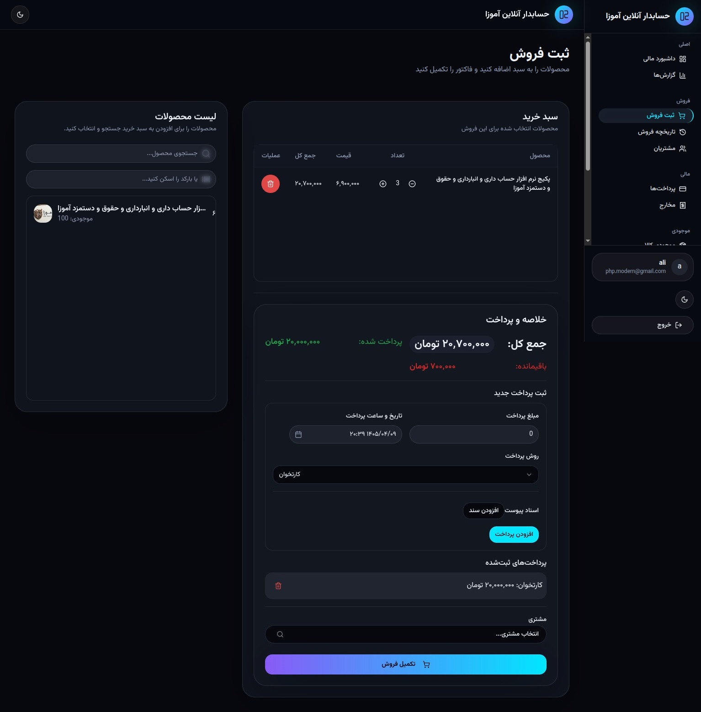

مشتری همه را یک‌جا نداد؟ مشکلی نیست:

- **پرداخت شده** (سبز) و **باقیمانده** (قرمز) خودکار محاسبه می‌شود
- چند پرداخت با روش‌های مختلف ثبت کنید
- باقیمانده در **گزارش‌ها** به‌عنوان **مطالبات** نمایش داده می‌شود

> **نکته:** از هر صفحه‌ای با دکمه **ثبت فروش** بالای صفحه می‌توانید سریع فاکتور بزنید.

---

### ۴.۳ اسناد پیوست — فیش بانکی نامحدود

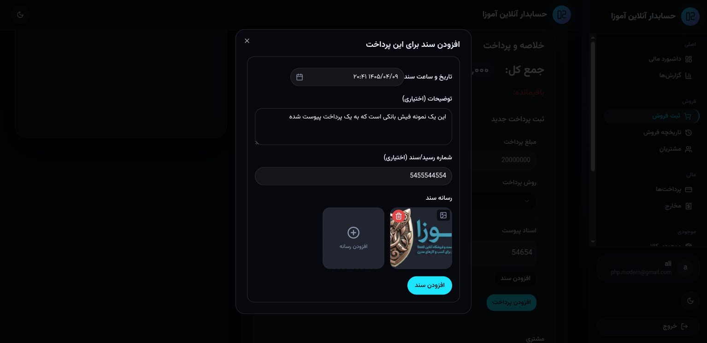

برای هر پرداخت می‌توانید **تعداد نامحدود سند** پیوست کنید:

1. **افزودن سند** را بزنید
2. تاریخ، توضیحات، شماره رسید را وارد کنید
3. **تصویر فیش** یا رسید را آپلود کنید
4. **افزودن سند** را تأیید کنید

> **نکته:** در **تاریخچه فروش** با آیکون گیره کاغذ می‌توانید اسناد هر پرداخت را ببینید — دیگر فیش گم نمی‌شود.

---

## بخش ۵: پرداخت‌ها

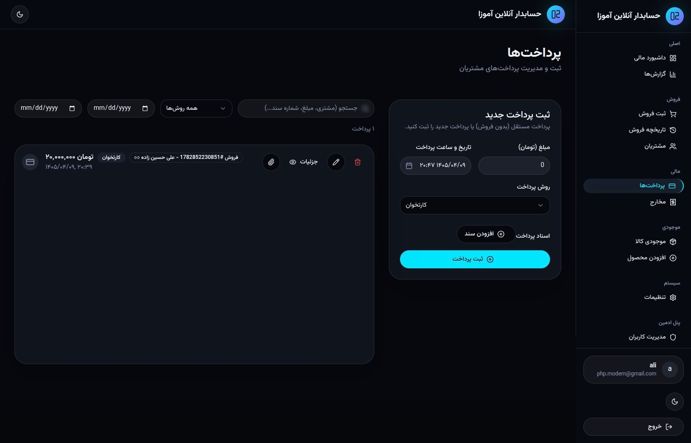

**امکانات:**

- لیست تمام پرداخت‌های مشتریان
- فیلتر بر اساس **تاریخ، روش پرداخت، جستجو**
- ثبت **پرداخت مستقل** (بدون فاکتور فروش)
- پیوست سند، ویرایش و حذف

**روش‌های پرداخت:** نقد | کارتخوان | آنلاین

---

## بخش ۶: مخارج — لحظه‌ای و دوره‌ای

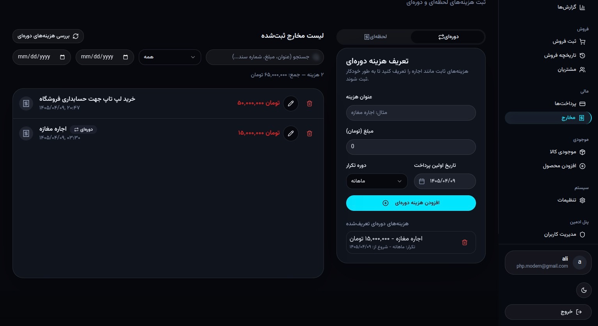

### مخارج لحظه‌ای

خرید لپ‌تاپ، تعمیرات، هزینه‌های یک‌بار — با تاریخ، مبلغ و پیوست رسید.

### مخارج دوره‌ای (اجاره مغازه و ...)

1. در پنل **تعریف هزینه دوره‌ای**:
   - عنوان (مثلاً اجاره مغازه)
   - مبلغ
   - دوره: **ماهانه** یا **سالانه**
   - تاریخ اولین پرداخت
2. **افزودن هزینه دوره‌ای** را بزنید

> **نکته:** مخارج دوره‌ای **خودکار** در گزارش سود لحاظ می‌شوند — اجاره هر ماه دوباره ثبت نکنید.

---

## بخش ۷: داشبورد مالی

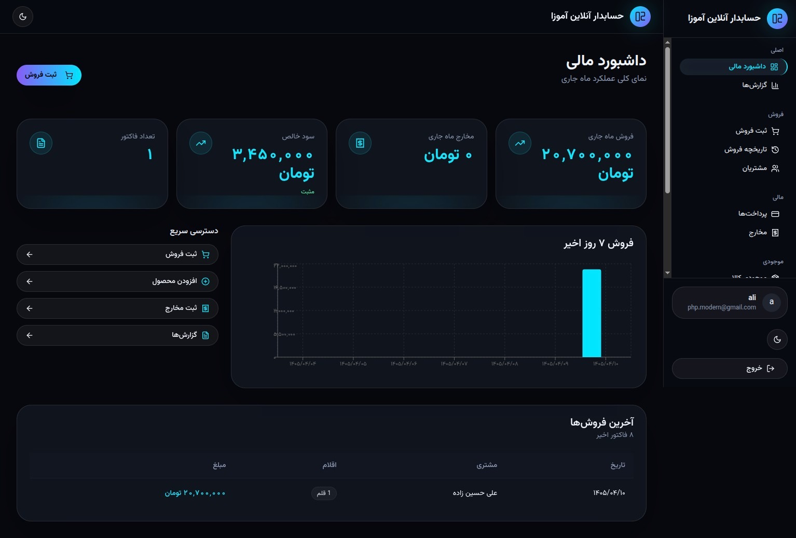

**نمای کلی ماه جاری:**

| کارت | معنی |
|------|------|
| **فروش ماه جاری** | مجموع فروش |
| **مخارج ماه جاری** | هزینه‌های ثبت‌شده |
| **سود خالص** | فروش منهای مخارج (با علامت مثبت/منفی) |
| **تعداد فاکتور** | چند فروش انجام شده |

**همچنین:**

- **دسترسی سریع** — ثبت فروش، افزودن محصول، مخارج، گزارش‌ها
- **نمودار فروش ۷ روز گذشته**
- **آخرین فروش‌ها** — جدول زنده
- **هشدار کمبود موجودی**

---

## بخش ۸: گزارش‌ها و نمودارهای زنده

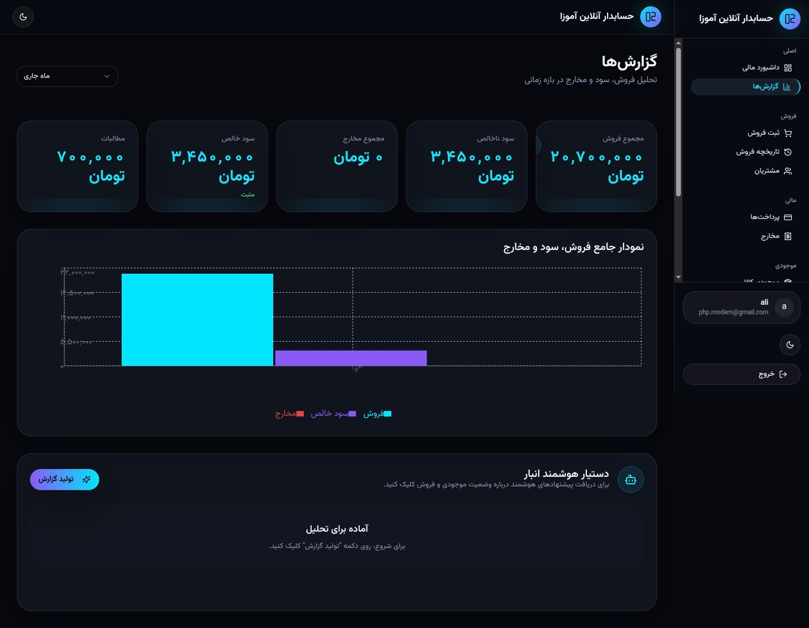

**فیلتر بازه زمانی:** هفته جاری/گذشته، ماه جاری/گذشته، سال جاری/گذشته، کل بازه

**شاخص‌ها:**

- مجموع فروش
- سود ناخالص
- مجموع مخارج
- **سود خالص**
- **مطالبات** (بدهی مشتریان)

**نمودار جامع:** فروش (فیروزه‌ای)، سود خالص (بنفش)، مخارج (قرمز)

---

## بخش ۹: تاریخچه فروش

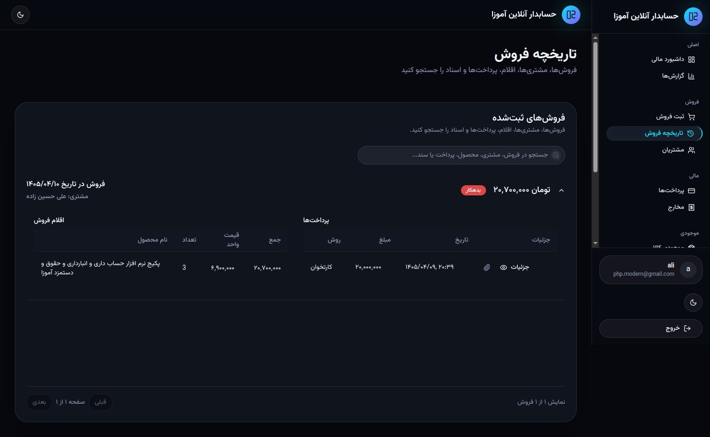

- جستجو در فروش، مشتری، محصول، پرداخت و سند
- جزئیات هر فاکتور: **اقلام، پرداخت‌ها، اسناد**
- وضعیت **بدهکار/تسویه**
- صفحه‌بندی برای حجم بالا

---

## بخش ۱۰: دستیار هوشمند انبار

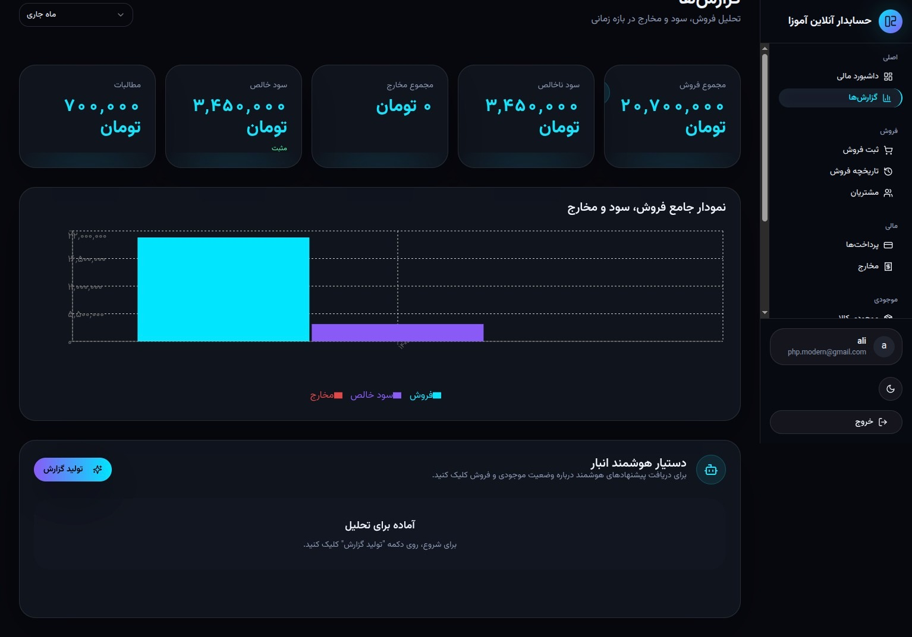

در صفحه **گزارش‌ها**، بخش **دستیار هوشمند انبار**:

1. **تولید گزارش** را بزنید
2. پیشنهادهای هوشمند درباره **وضعیت انبار و فروش** دریافت کنید
3. تصمیم بگیرید چه بخرید، چه تخفیف بدهید، چه کالایی کم است

> **نکته:** این قابلیت از هوش مصنوعی برای تحلیل داده‌های واقعی مغازه شما استفاده می‌کند — مثل یک مشاور که هر روز کنار شماست.

---

## خلاصه امکانات

| حوزه | امکانات |
|------|---------|
| **انبارداری** | بارکد، موجودی، هشدار کمبود، CSV |
| **حسابداری** | فروش، مخارج، سود، مطالبات |
| **چندارزی** | USD, AED, CNY → تومان + ردیف هزینه per محصول |
| **فروش** | POS، پرداخت جزئی، چند روش پرداخت |
| **مشتری** | CRM ساده، ردیابی بدهی |
| **کارمند** | حقوق خودکار، ورود جداگانه |
| **مخارج** | لحظه‌ای + دوره‌ای (اجاره، حقوق) |
| **اسناد** | پیوست نامحدود به پرداخت |
| **گزارش** | داشبورد زنده + نمودار + AI |
| **پلتفرم** | وب + دسکتاپ (Linux/Win/Mac) |
| **قیمت** | **رایگان** |
| **تم** | روشن / تاریک / سیستمی |

---

## شروع کنید — همین الان

1. بروید به **[hesab.amoza.ir](https://hesab.amoza.ir)**
2. **ثبت‌نام رایگان**
3. **نرخ ارز** و **عناوین هزینه** را تنظیم کنید
4. **اولین محصول** را اضافه کنید
5. **اولین فروش** را ثبت کنید
6. **داشبورد** را ببینید — سود واقعی‌تان آنجاست

> **یک بار امتحان کنید.** اگر مغازه دارید، آموزا همان ابزاری است که سال‌ها دنبالش بودید — و رایگان است.

---

*نسخه ۱.۰ — حسابدار آنلاین آموزا — [hesab.amoza.ir](https://hesab.amoza.ir)*

